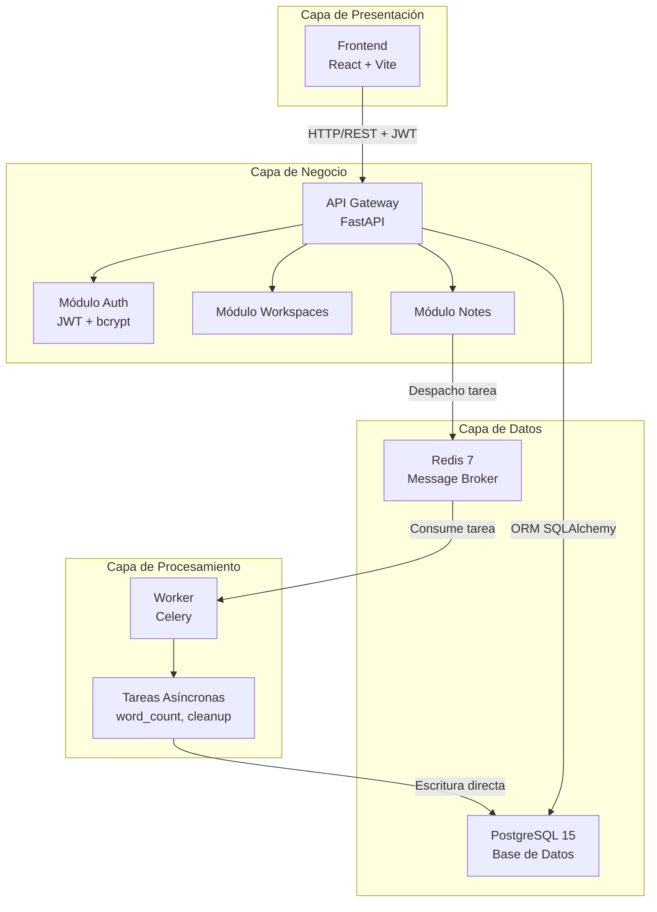
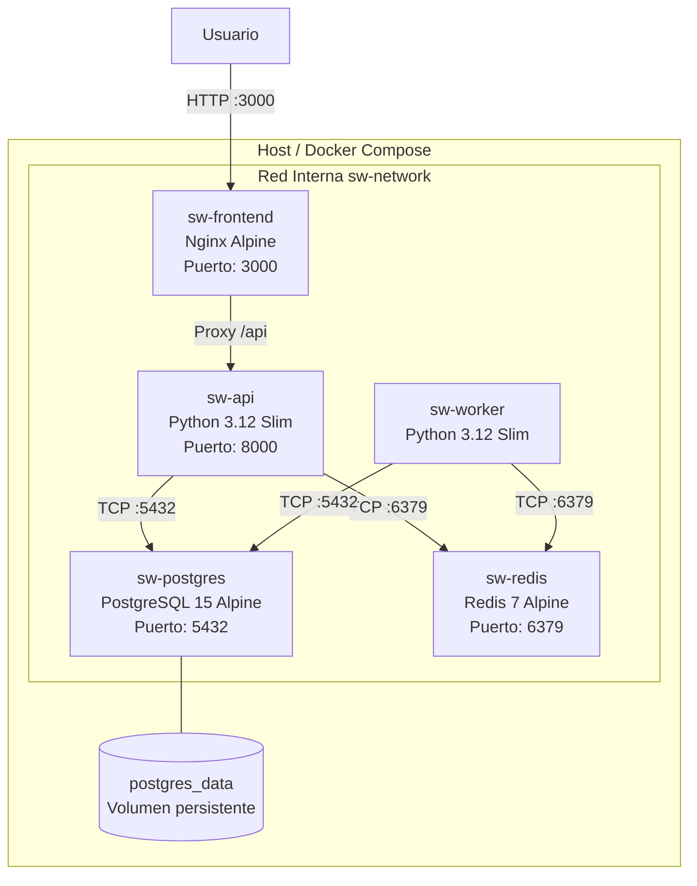
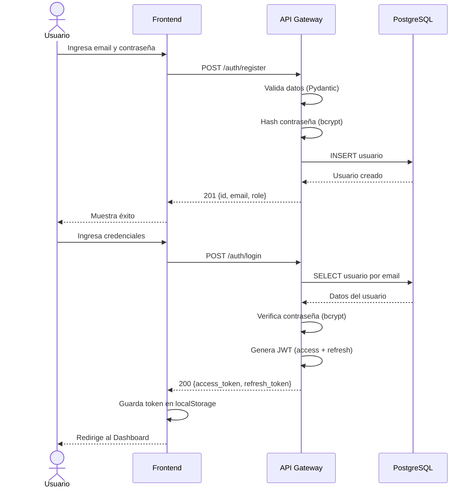
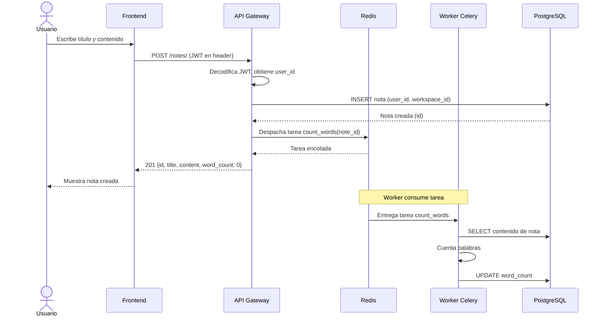
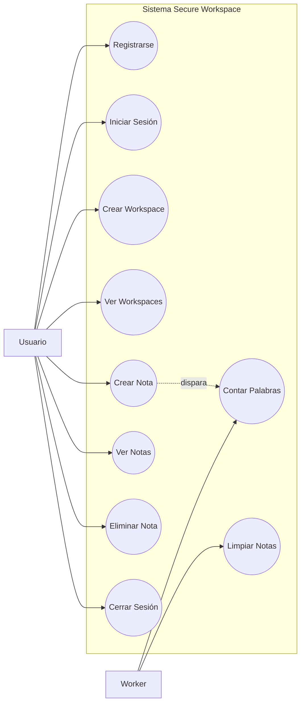
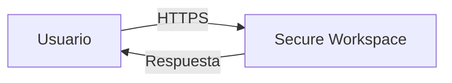
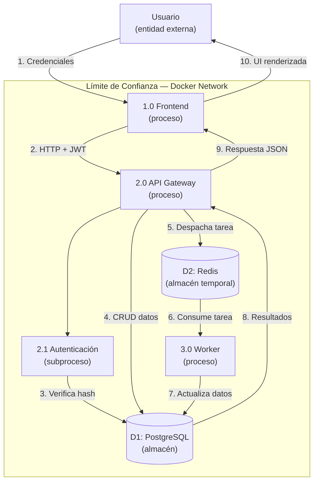

# Informe Técnico — Secure Workspace

# Pipeline DevSecOps de Ciclo Completo para una Aplicación Contenerizada

---

**Proyecto**: Secure Workspace  
**Licencia**: MIT  
**Fecha**: Mayo 2026  
**Repositorio**: https://github.com/ROBERT0024/sevwork  
**Docker Hub**: https://hub.docker.com/u/robert0024

### Equipo

| Nombre | Rol |
|--------|-----|
| ROBERT0024 | Desarrollo y DevSecOps |
| diegohrnz89-ai | Desarrollo y DevSecOps |
| Carlos.Gonzalez | Desarrollo y DevSecOps |
| danielmaodaza | Desarrollo y DevSecOps |

**Especialización en Ciberseguridad — Énfasis DevSecOps**

---

## 1. Introducción

### 1.1 Justificación

Secure Workspace nace como respuesta a la necesidad de demostrar, de forma práctica e integral, cómo se implementa un pipeline DevSecOps de ciclo completo alrededor de una aplicación real. El proyecto no se limita a construir una aplicación funcional; su verdadero valor reside en la integración de la seguridad como práctica continua en cada etapa del ciclo de vida del software.

Se eligió una aplicación tipo Notion simplificada (gestión de notas y espacios de trabajo) como vehículo porque:

- Ofrece suficiente complejidad funcional para justificar una arquitectura de microservicios
- Requiere autenticación, autorización y manejo de datos sensibles del usuario
- Permite demostrar procesamiento asíncrono mediante workers
- Es fácilmente comprensible para evaluadores y usuarios finales

### 1.2 Objetivos

**Objetivo general**: Diseñar, implementar, asegurar y automatizar el ciclo de vida completo de una aplicación contenerizada, integrando seguridad desde el primer commit hasta la producción.

**Objetivos específicos**:

1. Construir una aplicación funcional con arquitectura de microservicios (Frontend, API Gateway, Worker, Base de Datos, Broker)
2. Contenerizar todos los servicios siguiendo buenas prácticas de seguridad (usuario no-root, imágenes mínimas)
3. Implementar un pipeline CI/CD con herramientas de seguridad FOSS integradas en cada fase
4. Documentar el modelo de amenazas utilizando STRIDE y OWASP Threat Dragon
5. Publicar imágenes versionadas en Docker Hub de forma automatizada
6. Proveer infraestructura como código (IaC) con Terraform y Ansible para despliegue reproducible

---

## 2. Arquitectura

### 2.1 Descripción General

Secure Workspace implementa una arquitectura de microservicios con 5 componentes principales, comunicados a través de una red Docker aislada.

| Servicio | Tecnología | Puerto | Propósito |
|----------|------------|--------|-----------|
| Frontend | React 18 + Vite + Nginx | 3000 | Interfaz de usuario SPA |
| API Gateway | Python FastAPI 3.12 | 8000 | API REST, autenticación, lógica de negocio |
| Worker | Python Celery | — | Tareas asíncronas (conteo de palabras, limpieza) |
| PostgreSQL | PostgreSQL 15 Alpine | 5432 | Almacenamiento persistente |
| Redis | Redis 7 Alpine | 6379 | Broker de mensajes para Celery |

### 2.2 Diagrama de Componentes



### 2.3 Diagrama de Despliegue



### 2.4 Diagrama de Secuencia — Autenticación



### 2.5 Diagrama de Secuencia — Creación de Nota con Worker



### 2.6 Diagrama de Casos de Uso



### 2.7 Diagrama del Pipeline DevSecOps

```
┌─────────┐     ┌─────────┐     ┌─────────┐     ┌─────────────┐
│  PLAN   │────▶│  CODE   │────▶│  BUILD  │────▶│    TEST     │
│         │     │         │     │         │     │             │
│Threat   │     │Gitleaks │     │Docker   │     │Pytest + Cov │
│Dragon   │     │Bandit   │     │build    │     │OWASP ZAP    │
│STRIDE   │     │Semgrep  │     │Trivy    │     │             │
│         │     │Trivy SCA│     │Checkov  │     │             │
└─────────┘     └─────────┘     └────┬────┘     └──────┬──────┘
                                     │                  │
                              CVE crítico?         ¿Tests OK?
                                     │ Sí               │ No
                                     ▼                  ▼
                              ❌ FALLA BUILD      ❌ FALLA BUILD
                                     │ No               │ Sí
                                     └────────┬─────────┘
                                              ▼
                                      ┌───────────────┐
                                      │   RELEASE     │
                                      │               │
                                      │semver tag     │
                                      │Docker Hub push│
                                      └───────────────┘
```

---

## 3. Modelado de Amenazas

### 3.1 Metodología

El modelo de amenazas sigue la metodología **STRIDE** de Microsoft. Se generó un archivo de modelo compatible con **OWASP Threat Dragon** (`docs/threat-model.json`) y se documentaron diagramas de flujo de datos (DFD) en niveles 0 y 1.

### 3.2 DFD Nivel 0 — Contexto del Sistema



El sistema recibe peticiones HTTP del usuario y devuelve respuestas con datos de workspaces y notas.

### 3.3 DFD Nivel 1 — Flujo Interno



### 3.4 Análisis STRIDE

#### Spoofing (Suplantación)

| Amenaza | Probabilidad | Impacto | Contramedida |
|---------|-------------|---------|--------------|
| Falsificación de JWT | Media | Alto | JWT firmado con HS256, expiración 30 min |
| Reutilización de token robado | Media | Alto | Expiración corta + refresh token separado |
| Registro con email falso | Alta | Bajo | Validación de formato con Pydantic |

#### Tampering (Manipulación)

| Amenaza | Probabilidad | Impacto | Contramedida |
|---------|-------------|---------|--------------|
| Inyección SQL | Baja | Crítico | ORM SQLAlchemy (consultas parametrizadas) |
| XSS en contenido de notas | Media | Medio | React escapa HTML por defecto |
| Modificar JWT en tránsito | Baja | Alto | Firma HS256, HTTPS en producción |

#### Repudiation (Repudio)

| Amenaza | Probabilidad | Impacto | Contramedida |
|---------|-------------|---------|--------------|
| Usuario niega acciones | Media | Medio | Timestamps en BD, logs con user_id |
| Borrado sin rastro | Baja | Medio | Campos created_at/updated_at |

#### Information Disclosure (Divulgación)

| Amenaza | Probabilidad | Impacto | Contramedida |
|---------|-------------|---------|--------------|
| Secretos en código fuente | Media | Crítico | Gitleaks en CI + .gitignore |
| IDOR — acceder notas de otro | Media | Alto | Filtro user_id en todas las queries |
| CVEs en dependencias | Alta | Alto | Trivy SCA con exit-code: 1 |

#### Denial of Service (DoS)

| Amenaza | Probabilidad | Impacto | Contramedida |
|---------|-------------|---------|--------------|
| Spam de registros | Alta | Medio | Rate limiting con slowapi |
| Agotamiento de conexiones BD | Baja | Alto | Connection pooling (SQLAlchemy) |

#### Elevation of Privilege (Elevación)

| Amenaza | Probabilidad | Impacto | Contramedida |
|---------|-------------|---------|--------------|
| Acceso a endpoints admin | Media | Crítico | Decorador require_role en FastAPI |
| Escape de contenedor | Baja | Crítico | Usuario no-root, imágenes slim, red aislada |

---

## 4. Implementación del Pipeline

### 4.1 Visión General

El pipeline DevSecOps se implementa en GitHub Actions mediante un único workflow (`devsecops.yml`) que automatiza 7 fases con herramientas FOSS.

| Fase | Herramienta | Propósito | Política de fallo |
|------|-------------|-----------|-------------------|
| Código (SAST) | Gitleaks | Detectar secretos filtrados | Reporta |
| Código (SAST) | Bandit | Vulnerabilidades en Python | Reporta |
| Código (SAST) | Semgrep | Patrones OWASP Top 10 | Reporta |
| Dependencias (SCA) | Trivy | CVEs en dependencias | **Falla con CRITICAL/HIGH** |
| IaC | Checkov | Misconfiguración Docker/Compose | Falla con checks no aprobados |
| Build | Trivy | CVEs en imágenes Docker | **Falla con CRITICAL** |
| Test | Pytest + Coverage | Pruebas unitarias + cobertura | Falla si hay tests rotos |
| DAST | OWASP ZAP | Escaneo dinámico de API | Reporta |
| Release | Docker Hub | Publicación de imágenes | Auto en tag vX.X.X |

### 4.2 Fase Code — Análisis Estático

**Gitleaks** escanea el historial completo de Git buscando secretos:

```yaml
- name: "Gitleaks — Detección de secretos"
  uses: gitleaks/gitleaks-action@v2
  continue-on-error: true
  env:
    GITHUB_TOKEN: ${{ secrets.GITHUB_TOKEN }}
```

**Bandit** analiza el código Python del API Gateway y Worker:

```yaml
- name: "Bandit — Análisis de seguridad Python"
  run: |
    pip install bandit
    bandit -r api-gateway/app/ -f json -o bandit-report.json || true
```

**Semgrep** busca patrones inseguros según reglas OWASP:

```yaml
- name: "Semgrep — Patrones de seguridad"
  uses: semgrep/semgrep-action@v1
  with:
    config: >-
      p/python
      p/security-audit
      p/owasp-top-ten
```

### 4.3 Fase Dependencies — SCA

**Trivy** escanea las dependencias de los 3 servicios:

```yaml
- name: "Trivy — Escaneo de dependencias API"
  uses: aquasecurity/trivy-action@master
  with:
    scan-type: 'fs'
    scan-ref: './api-gateway'
    severity: 'CRITICAL,HIGH'
    exit-code: '1'       # Pipeline FALLA si encuentra vulnerabilidades
```

### 4.4 Fase Build — Escaneo de Imágenes

Se construyen las 3 imágenes Docker y se escanean con Trivy:

```yaml
- name: "Build — API Gateway"
  run: docker build -t api-temp:${{ github.sha }} ./api-gateway

- name: "Trivy — Escaneo imagen API"
  uses: aquasecurity/trivy-action@master
  with:
    image-ref: 'api-temp:${{ github.sha }}'
    severity: 'CRITICAL'
    exit-code: '1'       # Falla si hay CVE crítico
    ignore-unfixed: true
```

### 4.5 Fase Test — Pruebas Unitarias

Se ejecutan 23 pruebas con cobertura de código:

```yaml
- name: "Ejecutar Pytest con Cobertura"
  run: |
    cd api-gateway
    pytest tests/ -v --tb=short --cov=app --cov-report=xml:coverage.xml
```

Tests implementados:
- **test_auth.py** (5 tests): registro, duplicados, password corta, login, health check
- **test_workspaces.py** (7 tests): CRUD, validación, IDOR
- **test_notes.py** (11 tests): CRUD, filtros, etiquetas, pinned, IDOR

### 4.6 Fase DAST — OWASP ZAP

Se levanta la API y se escanea dinámicamente:

```yaml
- name: "OWASP ZAP — Escaneo de API"
  uses: zaproxy/action-api-scan@v0.7.0
  with:
    target: 'http://localhost:8000/openapi.json'
    fail_action: false
```

### 4.7 Fase Release — Docker Hub

Las imágenes se publican automáticamente con versionado semántico:

```yaml
- name: "Build & Push — API Gateway RELEASE"
  uses: docker/build-push-action@v5
  with:
    context: ./api-gateway
    push: true
    tags: |
      ${{ env.DOCKER_HUB_USERNAME }}/sevwork:api-${{ steps.version.outputs.VERSION }}
      ${{ env.DOCKER_HUB_USERNAME }}/sevwork:api-latest
```

### 4.8 Escaneo de IaC — Checkov

Checkov valida los Dockerfiles y docker-compose:

```yaml
- name: "Checkov — Escaneo de Dockerfiles y Compose"
  uses: bridgecrewio/checkov-action@v12
  with:
    directory: .
    framework: dockerfile,yaml
    skip_check: CKV_DOCKER_2,CKV_DOCKER_3,CKV2_DOCKER_1
```

---

## 5. Resultados de Seguridad

### 5.1 Vulnerabilidades Encontradas y Remediadas

| Dependencia | CVE | Severidad | Estado | Acción Tomada |
|-------------|-----|-----------|--------|---------------|
| python-jose | CVE-2024-33663 | 🔴 Critical | ✅ Resuelto | Migrado a PyJWT 2.12.0 |
| python-jose | CVE-2024-33664 | 🟡 Moderate | ✅ Resuelto | Migrado a PyJWT 2.12.0 |
| python-multipart | CVE-2024-53981 | 🟠 High | ✅ Resuelto | Actualizado a 0.0.27 |
| python-multipart | CVE-2026-24486 | 🟠 High | ✅ Resuelto | Actualizado a 0.0.27 |

### 5.2 Ejemplo de Reporte Bandit

```
>> Issue: [B105:hardcoded_password_string] Possible hardcoded password
   Severity: Low   Confidence: Medium
   Location: app/config.py:15
```

**Evaluación**: Es el valor por defecto de `JWT_SECRET_KEY` en `config.py`. En producción se sobreescribe con variable de entorno. No es un riesgo real ya que `pydantic-settings` carga desde `.env`.

### 5.3 Ejemplo de Reporte Trivy (SCA)

```
api-gateway/requirements.txt (pip)
Total: 0 (HIGH: 0, CRITICAL: 0)
✅ Sin vulnerabilidades críticas o altas
```

Después de la remediación de python-jose y python-multipart, el escaneo de dependencias pasa limpio.

### 5.4 Controles de Seguridad Implementados

| Control | Implementación | Evidencia |
|---------|---------------|-----------|
| Contraseñas | bcrypt con salt automático (passlib) | `deps.py:18` |
| JWT | Access (30 min) + Refresh (7 días) | `deps.py:34-47` |
| IDOR | Filtro user_id en todas las queries | `routers/notes.py:41`, `routers/workspaces.py:24` |
| Rate Limiting | slowapi en API Gateway | `main.py:23` |
| Headers de Seguridad | HSTS, X-Frame-Options, CSP, X-XSS | `main.py:54-63` |
| Contenedores | Usuario no-root, imágenes slim | `Dockerfile:15,29` |
| Secretos | .env + GitHub Secrets + Gitleaks | `.gitignore`, `devsecops.yml` |
| Input Validation | Esquemas Pydantic | `schemas.py` |

### 5.5 Excepciones Documentadas

Actualmente no hay excepciones de seguridad activas. Todas las vulnerabilidades conocidas han sido remediadas.

---

## 6. Monitoreo y Observabilidad

> **Nota**: La Fase 6 (Operate/Monitor) es opcional según los requisitos del trabajo. El directorio `monitoring/` está preparado para la integración futura de Prometheus y Grafana.

### 6.1 Observabilidad Actual

El proyecto cuenta con los siguientes mecanismos de observabilidad:

- **Healthchecks** en Docker Compose para PostgreSQL y Redis
- **Logs** accesibles via `docker-compose logs -f [servicio]`
- **Estado de contenedores** via `docker-compose ps` y `docker stats`
- **GitHub Actions Summary** con reportes detallados de cada herramienta de seguridad

### 6.2 Plan de Implementación Futura

Se ha reservado la carpeta `monitoring/` para:
- **Prometheus**: Recolección de métricas de la API (latencia, errores, requests)
- **Grafana**: Dashboards de visualización
- **Loki + Promtail**: Centralización de logs

---

## 7. Conclusiones

### 7.1 Desafíos Encontrados

1. **Compatibilidad de dependencias**: La librería `python-jose` tenía CVEs críticos (CVE-2024-33663) sin parche disponible. La solución fue migrar completamente a `PyJWT`, lo que requirió adaptar la generación y verificación de tokens en todo el backend.

2. **Falsos positivos en Bandit**: Los valores por defecto en `config.py` son reportados como contraseñas hardcoded. Esto requirió documentar la justificación en lugar de eliminar los defaults, ya que son necesarios para el arranque local.

3. **Configuración de OWASP ZAP en CI**: ZAP requiere que la API esté levantada durante el escaneo, lo que añade complejidad al pipeline. Se resolvió levantando la API con uvicorn en background antes del escaneo.

4. **Checkov y Docker**: Algunos checks de Checkov (como HEALTHCHECK en Dockerfile) se excluyen intencionalmente porque los healthchecks se definen a nivel de `docker-compose.yml`, no en el Dockerfile.

### 7.2 Limitaciones

- No se implementó verificación de email en el registro (sin servidor SMTP)
- No hay funcionalidad de recuperación de contraseña
- El monitoreo con Prometheus/Grafana queda como trabajo futuro
- HTTPS no está configurado para desarrollo local (solo headers HSTS para producción)

### 7.3 Lecciones Aprendidas

1. **La seguridad no se añade al final**: Integrar herramientas de seguridad desde el inicio del pipeline evita acumulación de deuda técnica de seguridad.
2. **El pipeline es tan fuerte como su política de fallo**: Configurar `exit-code: 1` en Trivy es lo que convierte un reporte informativo en una barrera real contra vulnerabilidades.
3. **Documentar obstáculos es tan valioso como resolverlos**: La migración de python-jose a PyJWT, documentada con CVEs específicos, demuestra gestión profesional de vulnerabilidades.
4. **IaC permite reproducibilidad**: Ansible y Terraform garantizan que el despliegue sea consistente en cualquier entorno.

### 7.4 Trabajo Futuro

- Implementar stack de monitoreo (Prometheus + Grafana + Loki)
- Añadir autenticación OAuth2 con proveedores externos (Google, GitHub)
- Implementar cifrado de notas en reposo
- Añadir pruebas de integración end-to-end con Playwright
- Configurar Falco para detección de anomalías en runtime
- Implementar CI/CD con despliegue a Kubernetes (K3s)

---

## Referencias

| Recurso | URL |
|---------|-----|
| OWASP Threat Dragon | https://owasp.org/www-project-threat-dragon/ |
| Gitleaks | https://github.com/gitleaks/gitleaks |
| Semgrep | https://semgrep.dev |
| Bandit | https://bandit.readthedocs.io |
| Trivy | https://aquasecurity.github.io/trivy/ |
| OWASP ZAP | https://www.zaproxy.org |
| Checkov | https://www.checkov.io |
| OWASP DevSecOps Guideline | https://owasp.org/www-project-devsecops-guideline/ |
| CIS Docker Benchmark | https://www.cisecurity.org/benchmark/docker |
| The Twelve-Factor App | https://12factor.net |
